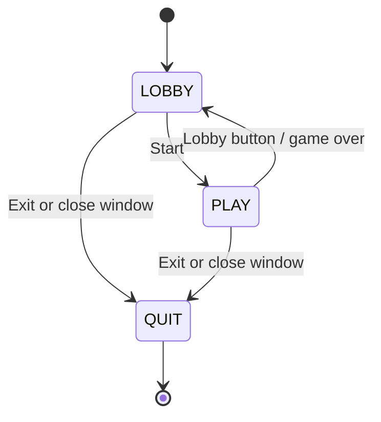

# Coin Collector

A 2D arcade game in Python and Pygame: collect coins to score and speed up, dodge bombs, and complete objectives for rewards.

Solo personal project, built from scratch in April–May 2025 (original commits are under my previous GitHub account, DeadWatch0) and tidied up in September 2026.

## Gameplay

Pick a character in the lobby, then collect as many coins as you can before your health runs out. You start with 3 health, 5 coins and 3 bombs on screen.

| Item | Effect |
|---|---|
| Coin | +1 point; permanently raises your speed and acceleration; a new coin appears |
| Bomb | −1 health; a new bomb and a health potion appear |
| Health potion | +1 health, up to your maximum |
| Chest | Appears when you complete the objective (collect 10 coins); opening it scatters its rewards around it |
| Max-health potion (from chest) | +1 maximum health and a full heal |
| Slow-down potion (from chest) | Takes back a large chunk of the speed you've built up |

When health reaches zero, the game-over screen shows your final and best scores, then returns you to the lobby.

## Controls

| Action | Input |
|---|---|
| Move | WASD or arrow keys |
| Change character (lobby) | Click the left / right buttons |
| Start (lobby) | Click Start |
| Back to lobby / quit (in game) | Buttons in the top-right corner |

## Running it

Requires Python 3 and pygame 2.6.1 (pinned in `requirements.txt`).

```bash
python -m venv .venv
source .venv/bin/activate        # Windows: .venv\Scripts\activate
pip install -r requirements.txt
python main.py
```

## Building a Windows executable

```bash
pip install pyinstaller
pyinstaller CoinGame.spec
```

This produces `dist/CoinGame.exe`: a single file with all assets bundled and no console window. PyInstaller builds for the operating system it runs on, so build on Windows to get a Windows executable.

## Save data

- **Location:** the high score is stored as JSON in `~/.coin_game/save_data.json` (on Windows, `C:\Users\<you>\.coin_game\`).
- **When it saves:** only when a run ends in game over. Quitting mid-run doesn't save.
- **Old saves:** a `save_data.json` next to the game from older versions is still read.
- **Damaged file:** a missing or corrupt save falls back to defaults with a warning instead of crashing.

## Architecture

The game is a small finite-state machine. Each state's handler runs its own loop and returns the next state.



| Module | Responsibility |
|---|---|
| `main.py` | Entry point; wires states to handlers and runs the state machine |
| `fsm.py` | Minimal state machine |
| `settings.py` | Window, asset paths, shared game state, sprite groups, objective setup |
| `lobby.py` | Character-selection screen |
| `level.py` | Game loop (60 FPS, delta-time based) |
| `character.py` | Player movement physics |
| `game_elements.py` | `Obstacle` base class with a shared `spawn()`; coins, bombs, potions, chest, buttons |
| `collisions.py` | Spatial-hash broad phase, then exact rectangle checks |
| `objective.py` | Objective system and `ObjectiveManager` |
| `hud.py` | Score and health display |
| `persistence.py` | JSON save and load |
| `game_over.py` | Game-over screen |
| `preview_sprite.py` | Character preview in the lobby |

## Implementation notes

- **Movement physics:**
  - Key input sets a direction; speed ramps up from a base speed towards a cap.
  - Releasing the keys applies exponential damping, and velocity is zeroed at the screen edges.
  - All movement is scaled by delta time, so it's frame-rate independent.
- **Collision detection:**
  - Every frame, items are bucketed into 128 px spatial-hash cells, inserted into every cell they overlap, so nothing is missed at cell corners.
  - Only items near the player's corners get an exact rectangle test.
- **Spawning:** random placement retries up to 20 times to avoid overlapping existing sprites, with a fallback position if the screen is crowded.
- **Reward grace frame:** potions dropped by the chest can't be collected in the same frame they appear.
- **Cached HUD text:** text is only re-rendered when a value changes.
- **Objectives:**
  - Each objective pairs a check function with a reward callback, and `ObjectiveManager` runs them in sequence.
  - Factories exist for "collect N coins" and "survive N seconds" objectives.
- **Path handling:** asset and save paths resolve relative to the code, or to PyInstaller's bundle directory, so the game runs from any working directory and as a frozen executable.

## Development notes

The repo's Claude Code settings deny AI edits to the Python source files and ask before running PyInstaller, so any AI assistance stays advisory.
